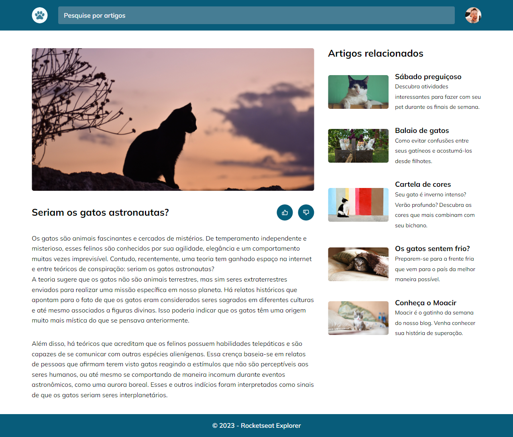

## 💻 Cat's Blog
Esse projeto foi um desafio de recriar uma aplicação, a partir de um layout pronto no Figma utilizando o "display: grid;".

  

## 🚀 Tecnologias

Esse projeto foi desenvolvido com as seguintes tecnologias:

- HTML
- CSS
- Git e Github

---

[Clique aqui para acessar](https://pedro-k.github.io/cat_blog/)

E-mail para contato: pedro.kleinfelder@hotmail.com